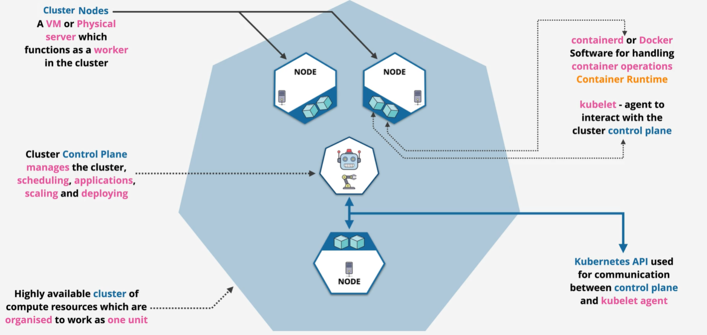

# Container Orchestration Knowledge
## Docker

### Docker Compose
### Docker Swarm

## Kubernates

### Fundamental concepts

  
K8s components

   

 + Control Plane Components:

  1. **kube-apiserver:** The core component that exposes the Kubernetes API.
  2. **etcd:** A consistent and highly-available key-value store used for all cluster data.
  3. **kube-scheduler:** Assigns pods to nodes based on resource availability.
  4. **kube-controller-manager:** Runs various controllers to manage the state of the cluster.
  5. **cloud-controller-manager:** Integrates with cloud providers (optional).

  + Node Components

  1. **kubelet:** Ensures that containers are running in a pod.
  2. **kube-proxy:** Maintains network rules on nodes to facilitate communication between pods.
  3. **Container runtime:** Software responsible for running containers (e.g., Docker, containerd).

  + Additional Components

  
  

### Cluster structure

  
Cluster structure

   
  
  
  

